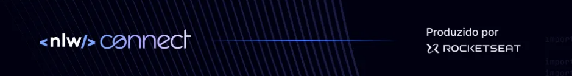
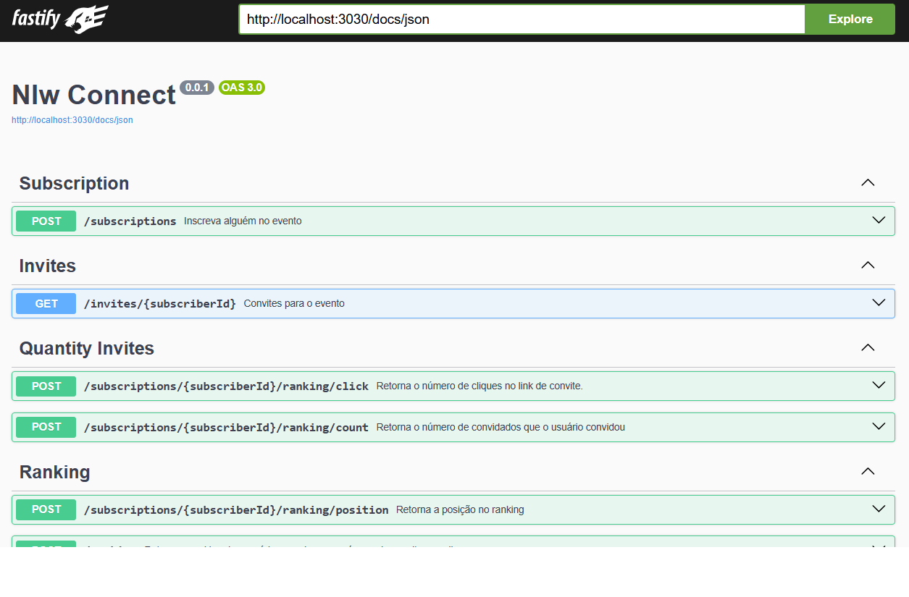
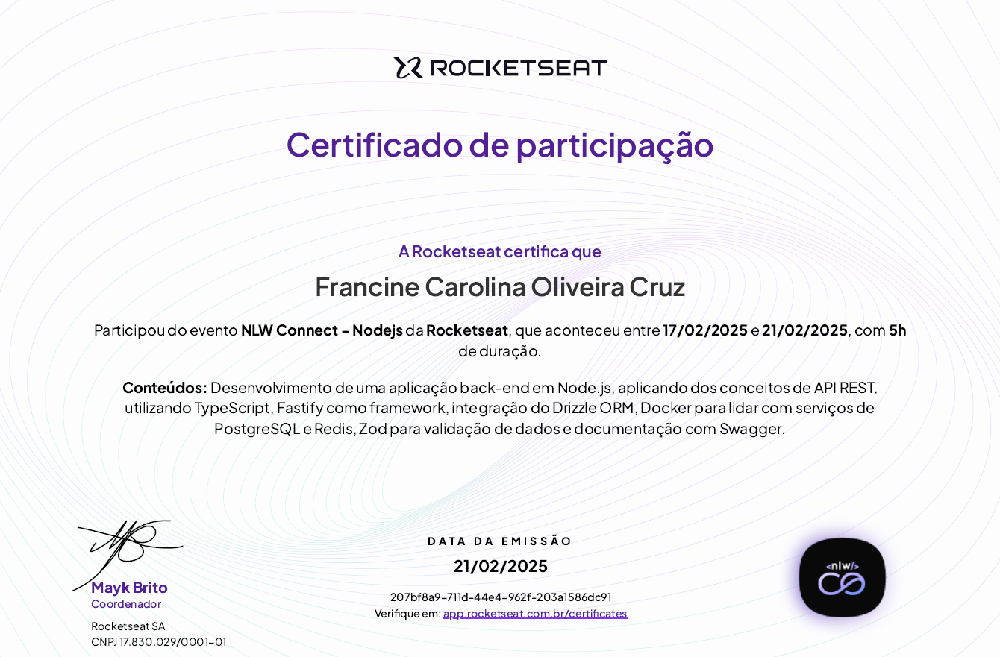

<h1 align="center"> 
   
  <br>
  <br>
  Nlw - Connect: DevStage
  <p >
    
    
    
  </p>
</h1>

O DevStage é um projeto de inscrição em eventos, focado em funcionalidades de indicação. Nessa edição do nlw, foi desenvolvido o backend em três aulas, criando um sistema completo para gerenciar convites e ranking de indicações para eventos online.

## 🚀 Tecnologias Utilizadas
- 
- 
- 
- 
- 
- 
- 

## 📚 Endpoints
A API foi desenvolvida utilizando Fastify e oferece as seguintes rotas principais:

- /subscriptions: Rota para inscrição de um novo usuário
- /invites/:subscriberId: Rota para gerar um link de convite para o evento
- /subscriptions/:subscriberId/ranking/count: Rota para consultar a quantidade de convites de um usuário
- /subscriptions/:subscriberId/ranking/click: Rota para consultar a quantidade de clicks em um link
- /subscriptions/:subscriberId/ranking/position: Rota para consultar a posição do usuário no ranking
- /ranking: Rota para consultar o ranking de todos os usuários

## 📖 Documentação
A API utiliza Swagger para documentar os endpoints de forma interativa.



## 🗂️ Estrutura do Projeto

O projeto está organizado da seguinte forma:
```
src/
├── drizzle/                # Configurações relacionadas ao Drizzle ORM
│   ├── migrations/         # Scripts para alterações no banco de dados
│   ├── tables/             # Definição da tabela
├── functions/              # Lógica de negócios 
├── redis/                  # Configuração do Redis
├── routes/                 # Rotas definidas da API
```


## 🛠️ Como Rodar o Projeto

1. Clone o repositório:

```

https://github.com/Francine02/Nlw---DevStage.git


```

2. Configure .env para as variáveis de ambiente como: url para redirecionamento, conexão com o PostgreSQL url e do Redis.

3. Compile e rode o projeto.

4. Acesse a API em  [http://localhost:3030/docs](http://localhost:3030/docs)


## 🤝 Contribuindo
1. Faça um fork deste repositório.
2. Crie uma branch para a sua feature (git checkout -b feature-nome-da-feature).
3. Faça o commit das suas alterações (git commit -m 'Adiciona nova feature').
4. Envie para o repositório remoto (git push origin feature-nome-da-feature).
5. Crie um novo Pull Request.

#### Obs.:
- Por favor, siga as convenções de commits do projeto.
- Certifique-se de que o código esteja bem documentado antes de enviar o PR.

## 💜 Agradecimentos
Agradeço à [Rocketseat](https://github.com/Rocketseat) por promover mais um nlw, que tornou possível a construção deste projeto e proporcionou um ambiente de aprendizado prático e inspirador.

<div align="center">
  
</div>
